<div align="center">

# 🚗 Autonomous Vehicle Lane Detection

**Real-time lane detection, curvature estimation and steering guidance built with classical computer vision (OpenCV).**


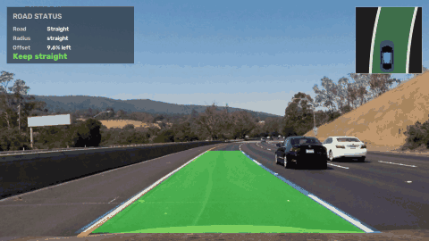

[How it works](#-how-it-works) •
[Results](#-results) •
[Quick start](#-quick-start) •
[Usage](#-usage) •
[Report](#-report)

</div>

---

## ✨ Features

- **Curved and straight lanes:** camera calibration, a bird's-eye warp and polynomial lane models handle curves that a Hough-line detector can't.
- **Road understanding:** radius of curvature (in metres), left/right/straight classification, and the car's offset from the lane centre.
- **Steering guidance:** *Steer left*, *Steer right* or *Keep straight*, shown on a heads-up display with a live mini map.
- **Stable on video:** temporal smoothing, a guided search around the previous fit, and automatic recovery when the lane is lost.
- **Works on anything:** images, video files or a live webcam, at any input resolution. About 16 FPS on a laptop CPU.
- **Debug view:** `--debug` shows every pipeline stage side by side for threshold tuning.
- **Lightweight:** just OpenCV and NumPy, with no GPU and no training data.

## 🧠 How it works

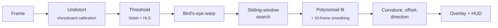

<p align="center">
  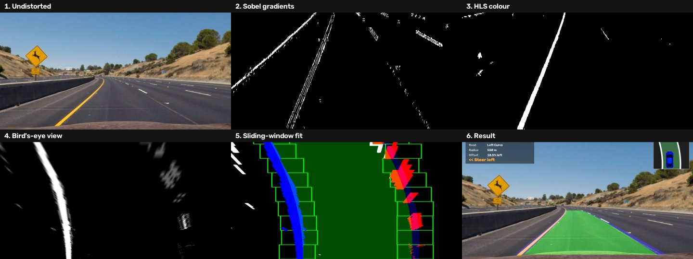
</p>

| # | Stage | What happens |
|---|-------|--------------|
| 1 | **Calibration and undistortion** | Twenty 9×6 chessboard photos give the camera matrix and distortion coefficients (computed once, then cached). |
| 2 | **Gradient threshold** | Sobel *x*/*y*, gradient magnitude and gradient direction on the red channel keep steep, lane-like edges. |
| 3 | **Colour threshold** | HLS saturation finds paint in sunlight, and hue with lightness recovers markings in shadow. |
| 4 | **Perspective transform** | The road trapezoid is warped to a 720×720 top-down view, where lane lines are parallel. |
| 5 | **Lane search** | Histogram peaks seed 9 sliding windows on the first frame. Later frames search around the previous curve. |
| 6 | **Fit and smooth** | Each line is fitted as `x = ay² + by + c` and averaged over the last 10 frames. |
| 7 | **Road geometry** | Radius `R = (1 + (2ay + b)²)^1.5 / abs(2a)` in metres (3.7 m lane), plus direction and lane offset. |
| 8 | **Visualisation** | The lane is projected back onto the road, and a status panel and mini map are drawn on top. |

## 📸 Results

<table>
  <tr>
    <td align="center">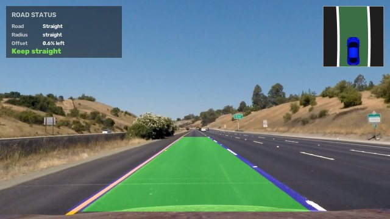<br><sub><b>Straight road</b></sub></td>
    <td align="center">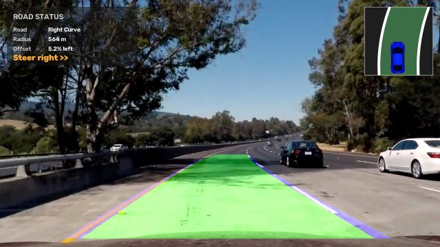<br><sub><b>Right curve</b></sub></td>
    <td align="center">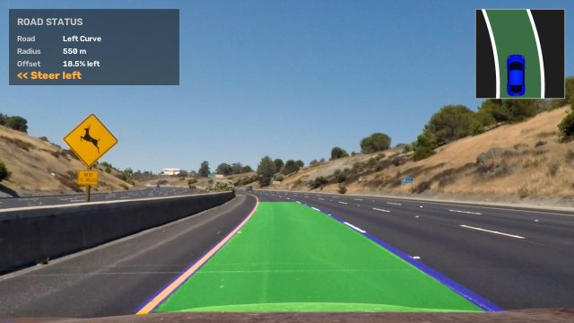<br><sub><b>Left curve</b></sub></td>
  </tr>
  <tr>
    <td align="center">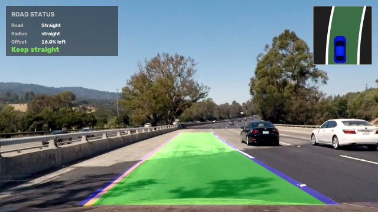<br><sub><b>Shadows and a lighter road surface</b></sub></td>
    <td align="center">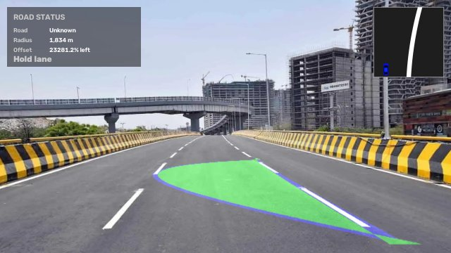<br><sub><b>Bridge</b></sub></td>
    <td align="center">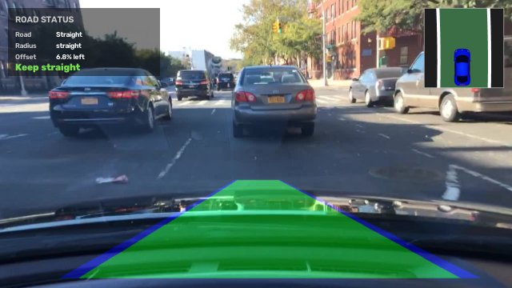<br><sub><b>City traffic</b></sub></td>
  </tr>
</table>

<p align="center">
  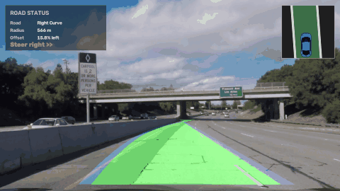<br>
  <sub>Tracking through a long right-hand curve, under an overpass and past overtaking cars.</sub>
</p>

### ⚠️ Where it struggles

Classical thresholds have limits, and these are the known ones:

<table>
  <tr>
    <td align="center">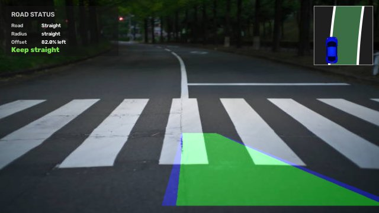<br><sub><b>Zebra crossing:</b> stripes out-vote the lane lines</sub></td>
    <td align="center">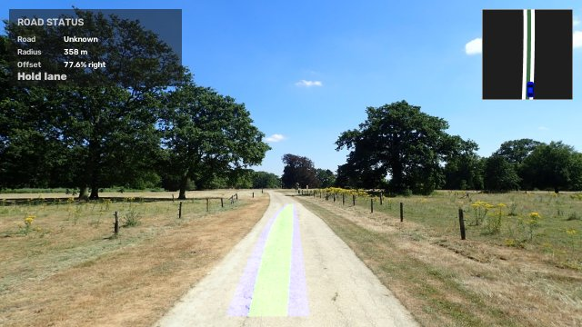<br><sub><b>Unmarked road:</b> nothing to detect</sub></td>
  </tr>
  <tr>
    <td align="center">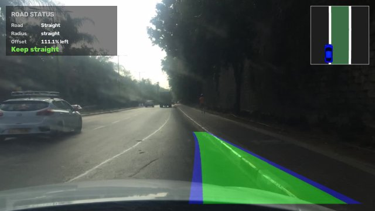<br><sub><b>Fog:</b> low contrast pulls the lane off-centre</sub></td>
    <td align="center">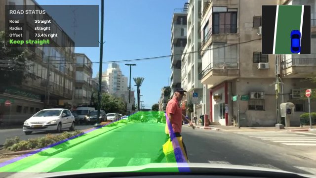<br><sub><b>Urban street:</b> kerbs and people confuse the search</sub></td>
  </tr>
</table>

More hard cases (night, rain, fog with zebra crossings) are in [`data/test_images/hard_cases/`](data/test_images/hard_cases/) and [`data/videos/`](data/videos/).

## 🚀 Quick start

```bash
git clone https://github.com/Anandpiyush21/Autonomous-Vehicle-Lane-Detection-using-OpenCV.git
cd Autonomous-Vehicle-Lane-Detection-using-OpenCV

python -m venv .venv
source .venv/bin/activate          # Windows: .venv\Scripts\activate
pip install -r requirements.txt

python -m lane_detection video data/videos/file2.mp4
```

## 🕹️ Usage

```bash
# Single image: prints the road status and opens a preview window
python -m lane_detection image data/test_images/test5.jpg

# Save the result instead of showing it
python -m lane_detection image data/test_images/test5.jpg -o output/test5.jpg --no-show

# Show every pipeline stage in a grid
python -m lane_detection image data/test_images/test2.jpg --debug

# Video file -> annotated video
python -m lane_detection video data/videos/file1.mp4 -o output/file1.mp4 --no-show

# Live webcam
python -m lane_detection video 0
```

| Option | Description |
|--------|-------------|
| `-o, --output PATH` | Save the annotated image or video |
| `--no-show` | Don't open a preview window (for servers or batch jobs) |
| `--no-hud` | Draw only the lane, without the status panel and mini map |
| `--debug` | Render the six-stage debug grid instead of the final frame |

While a video is playing, press **`p`** or **space** to pause and **`q`** to quit.

### Python API

```python
import cv2
from lane_detection import LanePipeline

pipeline = LanePipeline()
result = pipeline.process(cv2.imread("data/test_images/test5.jpg"))

print(result.status)
# RoadStatus(direction='Right Curve', curvature_m=564.1, offset_side='Left', offset_pct=5.2)
cv2.imwrite("out.jpg", result.output)
```

`LanePipeline` keeps state between calls, so feed it consecutive video frames, or call `pipeline.reset()` between unrelated images. You can tune the thresholds with `LanePipeline(thresholds=Thresholds(saturation=(100, 255)))`.

## 📁 Project structure

```
├── lane_detection/
│   ├── calibration.py     # chessboard calibration + undistortion (cached)
│   ├── thresholding.py    # Sobel gradient and HLS colour masks
│   ├── lanes.py           # sliding-window search, polynomial fit, curvature, offset
│   ├── hud.py             # status panel and bird's-eye mini map
│   ├── pipeline.py        # LanePipeline: the end-to-end detector
│   └── cli.py             # command-line interface
├── data/
│   ├── camera_cal/        # 20 chessboard images for calibration
│   ├── test_images/       # sample road images (+ hard_cases/)
│   └── videos/            # sample driving clips
├── docs/
│   ├── report/            # LaTeX report (report.tex, report.pdf)
│   ├── images/            # figures used in this README
│   └── Report_Lane_Detection.pdf
├── scripts/make_readme_assets.py   # regenerates the README images and GIFs
├── tests/                 # pytest suite
└── main.py                # shortcut for `python -m lane_detection`
```

## 🧪 Development

```bash
pip install -r requirements-dev.txt
pytest             # run the tests
ruff check .       # lint
python scripts/make_readme_assets.py   # rebuild README figures
```

## 📄 Report

- **[Technical report (PDF)](docs/report/report.pdf):** a short write-up of the method, parameters, results and limitations. The LaTeX source is [`docs/report/report.tex`](docs/report/report.tex) (build it with `tectonic report.tex` or `pdflatex`).
- **[Original project report (PDF)](docs/Report_Lane_Detection.pdf):** the full project report, including the first Canny + Hough prototype.

## 🔮 Future work

- Adaptive, per-frame thresholds and CLAHE contrast enhancement for fog, rain and night
- A lightweight segmentation network to replace the hand-tuned masks, keeping the geometric back end
- Detecting zebra crossings and rejecting them explicitly
- Lane-departure warnings and multi-lane tracking

## 🙏 Acknowledgements

The chessboard calibration images and the highway test images (`test*.jpg`, `straight_lines*.jpg`) come from Udacity's Self-Driving Car Nanodegree *Advanced Lane Lines* project.
